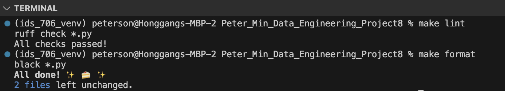
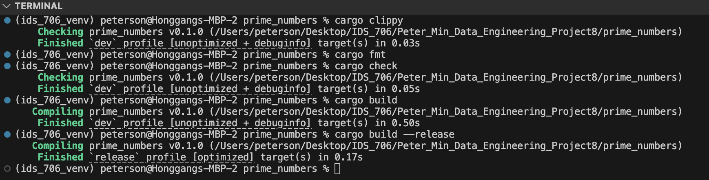
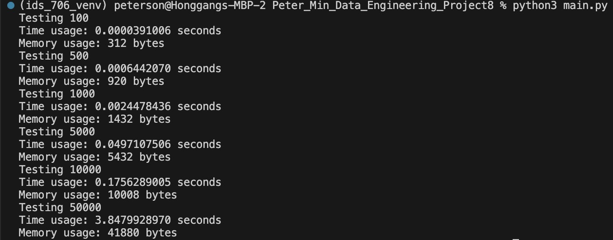
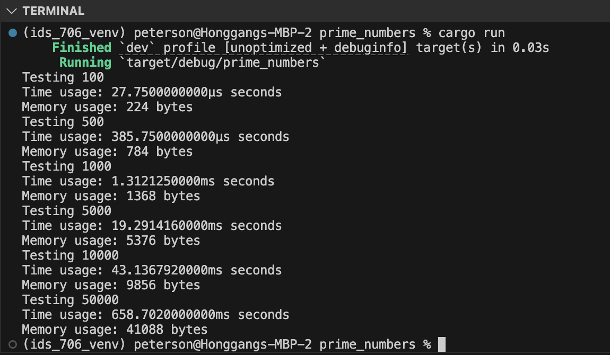

# Mini_Project_8


This is the README for my Mini Project 8 for the IDS706 - Data Engineering Systems class at Duke University.

## Overview
The purpose of this project is to translate an existing piece of code in Python3 to Rust and compare their performances. For this assignment, I wrote a naive algorithm that finds all prime numbers smaller than or equal to a specified non-negative value.

## Usage
To use the tool, first ensure you have Rust and Cargo installed:

```
rustc --version
cargo --version
```

Then navigate to this project folder and run the calculator in 1 of 2 ways:

`cargo run`

or
```
cd prime_numbers
cargo build
./target/release/prime_numbers
```

## Code Robustnes Check





## Performance





## Performance Summary Note
Since the performance values are in different units, here's a breakdown:
- For a target value of 100
    - Python's memory usage is 312 bytes, Rust's memory usage is 224 bytes, Rust uses **28.21% less memory** than Python.
    - Python's runtime is 0.000391006 second, Rust' runtime is 0.00002775 second, Rust runs **92.90% faster** than Python.
- For a target value of 500
    - Python's memory usage is 920 bytes, Rust's memory usage is 784 bytes, Rust uses **14.78% less memory** than Python.
    - Python's runtime is 0.000644207 seconds, Rust's runtime is 0.00038575 seconds, Rust runs **40.12% faster** than Python.
- For a target value of 1000
    - Python's memory usage is 1432 bytes, Rust's memory usage is 1368 bytes, Rust uses **4.46% less memory** than Python.
    - Python's runtime is 0.0024478436 seconds, Rust's runtime is 0.001312125 seconds, Rust runs **46.38% faster** than Python.
- For a target value of 5000
    - Python's memory usage is 5432 bytes, Rust's memory usage is 5376 bytes, Rust uses **1.03% less memory** than Python.
    - Python's runtime is 0.0497107506 seconds, Rust's runtime is 0.019291416 seconds, Rust runs **61.19% faster** than Python.
- For a target value of 10000 
    - Python's memory usage is 10008 bytes, Rust's memory usage is 9856 bytes, Rust uses **1.52% less memory** than Python.
    - Python's runtime is 0.1756289005 seconds, Rust's runtime is 0.043136792 seconds, Rust runs **75.44% faster** than Python.
- For a target value of 50000
    - Python's memory usage is 41880 bytes, Rust's memory usage is 41088 bytes, Rust uses **1.89% less memory** than Python.
    - Python's runtime is 3.8479928970 seconds, Rust's runtime is 0.658702 seconds, Rust runs **82.89% faster** than Python.
